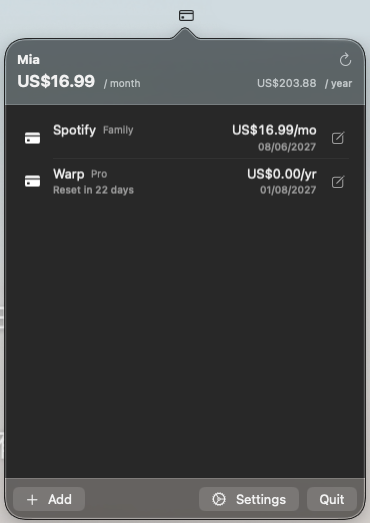

# Mia

> A native macOS menu-bar app for tracking subscriptions, spend, and provider usage.

[](#)
[](#)
[](#license)

Mia lives in your menu bar. It tracks every recurring service you pay for, warns before renewals, and pulls usage from APIs or local app sessions that expose it (Anthropic, OpenAI, Codex, Claude, Cursor, Zed, DeepSeek, OpenRouter, Perplexity, Codebuff, ElevenLabs, GroqCloud, Mistral, Moonshot, Poe, Kimi K2, Venice, Crof, Warp, T3 Chat, Ollama, Manus, Devin, MiniMax, Command Code, Qoder, Sakana AI, Abacus AI, Xiaomi MiMo, Chutes, CrossModel, ClawRouter, LLM Proxy, Synthetic, z.ai, Deepgram, Doubao, OpenCode, Wayfinder, Droid (Factory), Alibaba Coding Plan, Alibaba Token Plan, Windsurf, JetBrains AI, Kilo, OpenCode Go, StepFun, AWS Bedrock today). Local SwiftData store, Keychain-backed
secrets, no telemetry, no cloud.



## Features

- Menu-bar popover with subscriptions, monthly total, and quota progress.
- Built-in providers: **Manual**, **Anthropic** (Admin Usage API),
  **OpenAI** (Org Usage API), **Codex**, **Claude**, **Cursor**, **Zed**,
  **DeepSeek**, **OpenRouter**, **Perplexity**, **Codebuff**, **ElevenLabs**,
  **GroqCloud**, **Mistral**, **Moonshot**, **Poe**, **Kimi K2**, **Venice**,
  **Crof**, **Warp**, **T3 Chat**, **Ollama**, **Manus**, **Devin**, **MiniMax**,
  **Command Code**, **Qoder**, **Sakana AI**, **Abacus AI**, **Xiaomi MiMo**,
  **Chutes**, **CrossModel**, **ClawRouter**, **LLM Proxy**, **Synthetic**,
  **z.ai**, **Deepgram**, **Doubao**, **OpenCode**, **Wayfinder**, **Droid (Factory)**, **Alibaba Coding Plan**, **Alibaba Token Plan**, **Windsurf**, **JetBrains AI**, **Kilo**, **OpenCode Go**, **StepFun**, **AWS Bedrock**. Adding more is a one-file change.
- Local-source providers read existing app sessions (browser cookies, local
  files, other apps' Keychain items) so you don't have to paste API keys.
- Renewal and quota notifications, debounced once per day.
- Parallel sync (`TaskGroup` + per-provider timeout).
- Launch-at-login via `SMAppService`.

## Install

### Requirements
- macOS 14+ (Sonoma)

### GitHub Releases
Download: <https://github.com/maplerichie/Mia/releases>

### Homebrew
```bash
brew install --cask maplerichie/tap/mia
```

## Build

Requires Xcode 15+ and macOS 14+.

```bash
brew install xcodegen
xcodegen generate
open Mia.xcodeproj            # ⌘R
```

Or from the command line:

```bash
xcodebuild -scheme Mia -configuration Debug -destination 'platform=macOS' build
xcodebuild test  -scheme Mia -destination 'platform=macOS'
```

## Usage

1. Click **+** to add a subscription. Pick a provider; for API-backed
   providers, paste an API key — it's stored in macOS Keychain under
   `com.likkee.<providerKey>`, never in the SwiftData store. For local-source
   providers (Codex, Claude, Cursor, Zed, etc.), Mia reads the existing app
   session from your Mac; you can also paste a manual override if needed.
2. Click **⟳** to refresh, or wait for the launch-time sync.
3. Tune renewal-day and quota-percent thresholds in **⚙ Settings**.

Provider failures surface as a ⚠ on the affected row with the error in a
tooltip — they never crash the app.

## Architecture

```diagram
╭──────────────────────────────────────────────╮
│  MenuBarApp (NSStatusItem + NSPopover)       │
├──────────────────────────────────────────────┤
│  SubscriptionStore  (SwiftData)              │
│   • Subscription · UsageSnapshot             │
│   • ProviderCredential → Keychain            │
├──────────────────────────────────────────────┤
│  SyncEngine         (TaskGroup + timeout)    │
│  NotificationsService                        │
├──────────────────────────────────────────────┤
│  Provider protocol  →  implementations       │
│   • ManualProvider                           │
│   • AnthropicProvider                        │
│   • OpenAIProvider                           │
│   • CodexProvider · ClaudeProvider           │
│   • CursorProvider · ZedProvider             │
│   • DeepSeekProvider · OpenRouterProvider    │
│   • PerplexityProvider · CodebuffProvider    │
│   • ElevenLabsProvider · GroqCloudProvider   │
│   • MistralProvider · MoonshotProvider       │
│   • PoeProvider · KimiK2Provider             │
│   • VeniceProvider · CrofProvider            │
│   • WarpProvider · T3ChatProvider            │
│   • OllamaProvider · ManusProvider           │
│   • DevinProvider · MiniMaxProvider          │
│   • CommandCodeProvider · QoderProvider      │
│   • SakanaAIProvider · AbacusAIProvider      │
│   • XiaomiMiMoProvider · ChutesProvider      │
│   • CrossModelProvider · ClawRouterProvider  │
│   • LLMProxyProvider · SyntheticProvider     │
│   • ZaiProvider · DeepgramProvider             │
│   • DoubaoProvider · OpenCodeProvider        │
│   • WayfinderProvider · DroidFactoryProvider │
│   • AlibabaCodingPlanProvider · AlibabaTokenPlanProvider │
│   • WindsurfProvider · JetBrainsAIProvider   │
│   • KiloProvider · OpenCodeGoProvider        │
│   • StepFunProvider · AWSBedrockProvider     │
│   • <your provider>     ← open a PR          │
╰──────────────────────────────────────────────╯
```

| Layer | Responsibility |
|------|----------------|
| `MenuBar` | `NSStatusItem`, popover lifecycle |
| `Store` | SwiftData container, CRUD |
| `Sync` | Concurrent provider refresh |
| `Providers` | One file per service |
| `Security` | Keychain wrapper |
| `Notifications` | Renewal + quota alerts |

## Adding a Provider

The contribution surface is intentionally tiny:

> Copy a provider template, paste your fetch logic, append your type to one
> array, run the tests, open a PR.

Full recipe in **[`docs/ADDING_A_PROVIDER.md`](./docs/ADDING_A_PROVIDER.md)**.

Wanted: Spotify, Vercel, Linear, 1Password, Notion, Figma, and many more.
See CodexBar's provider list for inspiration.

> **Note:** GitHub Copilot is implemented but temporarily muted from the
> built-in list because it requires an OAuth client ID that cannot be shipped
> in the open-source repo. The code and tests remain; set a client ID in
> `GitHubCopilotProvider` and re-register it in `ProviderRegistry.builtIns` to
> enable it.

## Stack

Swift 5.10 · SwiftUI + AppKit · SwiftData · `URLSession` async/await ·
`UserNotifications` · `Security` (Keychain) · `SMAppService` · xcodegen.

No third-party runtime dependencies.

## Security

- Sandboxed; network entitlement plus temporary read-only exceptions for known
  local app directories used by local-source providers (e.g. `~/.codex`,
  `~/.claude`, Zed config, Cursor support files, Firefox cookies). These are
  narrowly scoped to the paths each provider reads.
- API keys: Keychain with `kSecAttrAccessibleWhenUnlockedThisDeviceOnly`.
- Local-source providers read existing app sessions (cookies, local files, other
  apps' Keychain items) only; they never write to another app's storage.
- Hardened runtime; notarization planned for distribution.

## License

MIT — see [`LICENSE`](./LICENSE).
